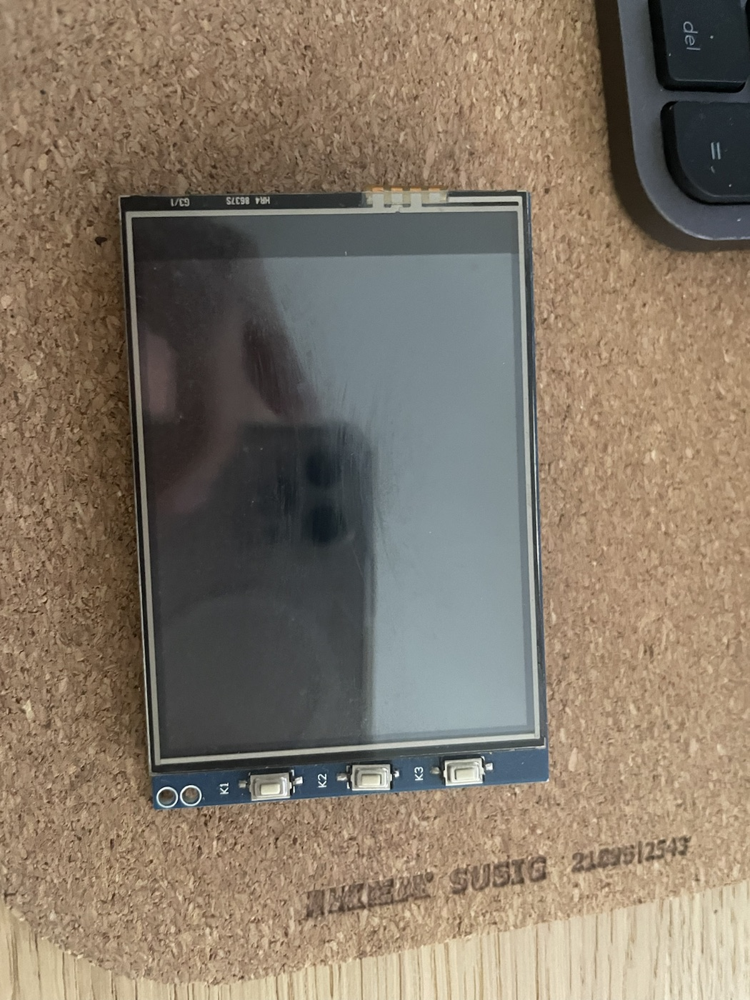
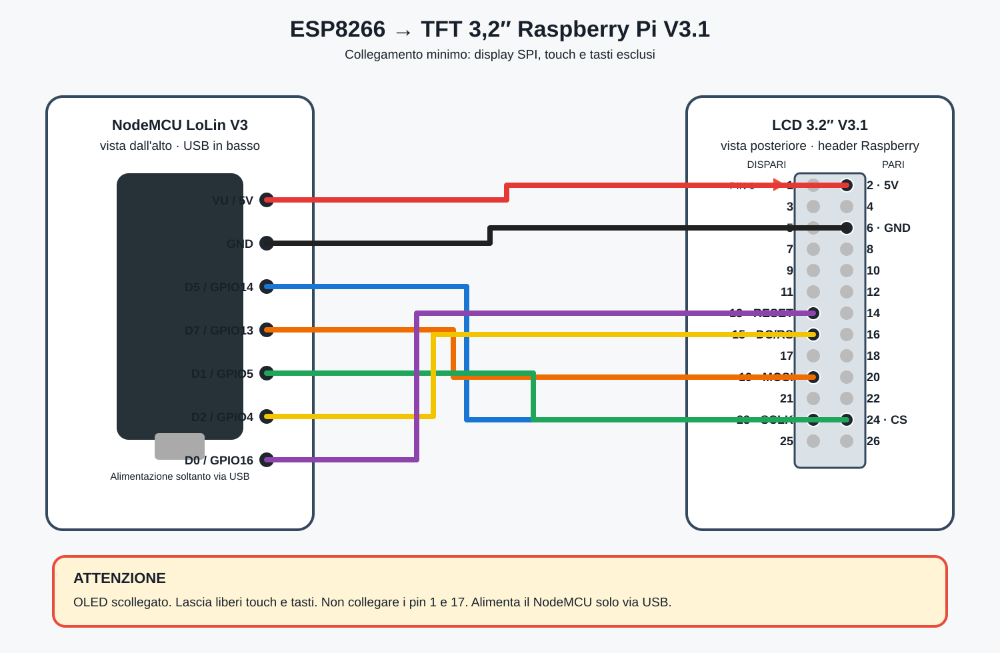

# ILI9341 Home Assistant Panel

Pannello grafico a quattro pagine basato su NodeMCU ESP8266 e display TFT SPI ILI9341 320×240 recuperato da una HAT Raspberry Pi Waveshare 3.2inch RPi LCD (B) o clone compatibile.





## Funzioni

- produzione fotovoltaica corrente e giornaliera;
- temperatura esterna;
- stato e freschezza dei dati Solarman;
- RSSI Wi-Fi e uptime;
- cambio pagina con pulsante momentaneo;
- configurazione Wi-Fi tramite captive portal;
- aggiornamento OTA tramite ESPHome.

## Hardware

- NodeMCU ESP8266 LoLin V3 o compatibile
- display ILI9341 320×240 con connettore Raspberry Pi
- pulsante momentaneo normalmente aperto
- jumper
- alimentazione USB 5 V adeguata

Il touch resistivo non viene utilizzato.

## Collegamenti

| Pin fisico LCD | Segnale | NodeMCU |
|---:|---|---|
| 1 | 3,3 V logica | 3V3 |
| 2 | 5 V alimentazione | VU / 5V |
| 6 | GND | GND |
| 13 | RESET | D0 / GPIO16 |
| 15 | DC / RS | D2 / GPIO4 |
| 19 | MOSI | D7 / GPIO13 |
| 23 | SCLK | D5 / GPIO14 |
| 24 | CS | D1 / GPIO5 |
| — | pulsante esterno | D6 / GPIO12 ↔ GND |

Il pulsante usa il pull-up interno: premendolo collega D6 a GND. Sulla replica provata i tasti K1/K2/K3 della HAT non seguivano la piedinatura Waveshare, quindi è stato usato un pulsante esterno.

## Entità Home Assistant

Modificare nel file `panel.yaml` gli ID delle entità Solarman e meteo affinché corrispondano alla propria installazione. Il nodo deve essere associato all'integrazione ESPHome.

## Compilazione e primo flash

```bash
python3 -m venv .venv
source .venv/bin/activate
pip install esphome
esphome config panel.yaml
esphome run panel.yaml
```

Se sono presenti più porte seriali, indicare quella corretta:

```bash
esphome run panel.yaml --device /dev/cu.usbserial-XXXX
```

Al primo avvio collegarsi all'access point `Pannello HA Setup` e aprire `http://192.168.4.1`. Cambiare prima la password di fallback nel file.

## Aggiornamento OTA e log

```bash
esphome run panel.yaml --device ili9341-home-panel.local
esphome logs panel.yaml --device ili9341-home-panel.local
```

## Note sulle prestazioni

La configurazione usa SPI hardware a 20 MHz, aggiornamento ogni 10 secondi e buffer parziale. Frequenze molto basse o refresh continui hanno causato watchdog durante i test sull'ESP8266.

## Sicurezza

- effettuare i collegamenti a dispositivo spento;
- non applicare 5 V ai GPIO;
- non pubblicare password, token, `secrets.yaml` o indirizzi privati;
- verificare l'assorbimento della retroilluminazione prima dell'uso a batteria.

## Licenza

MIT.
